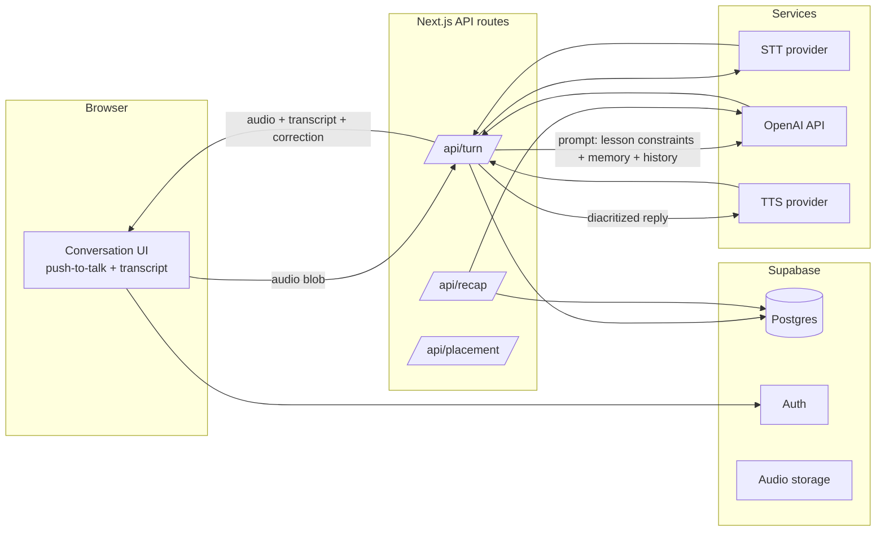

# Jalees — System Architecture (MVP)

Optimized for one builder coding with Claude: a single repo, one deploy target, managed services everywhere, no infrastructure to babysit.

## Stack

| Layer | Choice | Why |
|---|---|---|
| App framework | **Next.js (App Router, TypeScript)** | One repo for UI + API routes; best-documented stack for AI pair coding; deploys to Vercel in minutes |
| Database / Auth / Storage | **Supabase** | Postgres + auth + file storage in one service; generous free tier; RLS for per-user data |
| LLM (brain) | **OpenAI API (gpt-6-luna)** | Cheapest current frontier-family tier ($0.10/$0.50 per MTok) — chosen for cost over Claude; re-evaluate quality per Phase 0 results before committing |
| STT | **Whisper API (start) → evaluate Munsit** | Whisper is one API call to integrate; swap behind an interface later |
| TTS | **Arabic-specialized (SILMA / ElevenLabs Arabic)** | Behind the same swap-friendly interface; needs diacritized input |
| Payments | **Stripe** (deferred to Phase 4) | Standard subscription billing |
| Hosting | **Vercel** | Zero-ops; API routes handle the voice pipeline |

Rule: every external AI service sits behind a thin internal interface (`stt.ts`, `tts.ts`, `llm.ts`) so vendors are swappable without touching app logic.

## Component overview



## The voice turn (core loop)

1. Browser records via `MediaRecorder` (push-to-talk), posts blob to `/api/turn`.
2. **STT** → learner transcript. Show it to the learner ("Did I hear you right?") — this is the mitigation for ASR error-normalization.
3. **Prompt assembly** (see below) → the LLM returns structured JSON: `{reply_diacritized, reply_display, recast: {original, corrected, error_type} | null, prompt_repeat: bool}`.
4. **TTS** on `reply_diacritized` → audio URL.
5. Response to browser: audio + display text + recast card. Turn row saved to DB; mistakes saved to `mistakes`.

Turn-based means no streaming infra: each turn is one stateless API call. Target < 4s round trip; play a subtle "thinking" sound to cover latency.

## Prompt assembly (the real IP of the app)

System prompt built per-turn from:

- **Persona**: warm buddy, Fus'ha only, Islamic adab, speaks slightly above learner level
- **Lesson constraints**: allowed vocab + grammar list for current Madinah lesson (from `lessons` table) + explicit "do not use structures beyond lesson N"
- **Scenario**: current dialogue goal (e.g., "learner is buying fruit; guide them to use numbers + colors")
- **Memory facts**: top facts from `memory_facts`
- **Recent mistakes**: from `mistakes`, so the buddy engineers chances to retry them
- **Conversation history**: this session's turns

Output is always **fully diacritized internally**; display layer strips tashkeel per user level setting. TTS always receives the diacritized version.

## Data model (Postgres)

```
users            (Supabase auth)
profiles         user_id, display_name, level_book, level_lesson, tashkeel_pref, streak, created_at
lessons          id, book, lesson_no, vocab jsonb, grammar jsonb, scenario_ids
scenarios        id, lesson_id, title, goal, opening_line, target_structures jsonb
sessions         id, user_id, scenario_id, started_at, ended_at, minutes_used
turns            id, session_id, role, audio_url, transcript_raw, text_display, text_diacritized, recast jsonb
mistakes         id, user_id, session_id, error_type, original, corrected, review_due_at, review_count
memory_facts     id, user_id, fact, source_session_id, last_referenced_at
subscriptions    user_id, stripe_customer_id, status, plan, trial_ends_at
usage_daily      user_id, date, voice_seconds   -- enforces 10-min cap
```

Row-level security: every table keyed by `user_id` with Supabase RLS.

## Supporting flows

**Placement** (`/api/placement`): scripted 6–8 turn conversation with escalating difficulty; the LLM scores production per turn against the lesson ladder; writes `level_book/level_lesson` to profile.

**Session recap** (`/api/recap`): on session end, one LLM call over the session's turns + mistakes → recap card (patterns, not one-offs) + updates `memory_facts` (extract new personal facts) + schedules mistakes into spaced review (`review_due_at`: 1d/3d/7d/21d).

**Qur'an/hadith**: **out of scope for MVP conversations** — the buddy discusses daily-life scenarios and doesn't quote scripture. When added later: retrieval-only from Tanzil/verified hadith DB, exact rendering, real recitation audio. Never model-generated, never synthetic TTS.

**Cost control**: `usage_daily` gate before each turn; TTS responses for fixed scenario openers cached in storage; STT/TTS spend logged per turn.

## Build order (each phase is shippable)

- **Phase 0 — Constraint eval (no app).** Script that runs the LLM against 20 test conversations per lesson and flags vocabulary/grammar leaks above lesson N. If this fails, the product concept needs rework — test it before building anything. → [`phase0-eval/`](../phase0-eval)
- **Phase 1 — Text conversation loop.** Auth, lessons/scenarios tables (hand-author Book 2, lessons 1–5), `/api/turn` text-only, recast + display. Usable product for testing pedagogy with 5–10 real learners.
- **Phase 2 — Voice.** MediaRecorder capture, STT/TTS behind interfaces, transcript confirmation UI, session cap.
- **Phase 3 — Memory + recap + mistake review.** The retention layer.
- **Phase 4 — Placement + Stripe + polish.** Trial → subscription; landing page; creator-partnership launch.

## Top technical risks (watch continuously)

1. **Lesson-constraint leakage** — Phase 0 eval, re-run on every prompt change.
2. **STT on accented learner speech** — benchmark Whisper vs Munsit on real recordings from your test learners, not native-speaker samples.
3. **Latency** — if turn round-trip exceeds ~5s, stream the LLM text to screen while TTS generates.
4. **Diacritization quality** — The LLM's tashkeel is generally good but verify per-lesson — cheaper models drift more; a small post-check pass (e.g., CAMeL Tools) can flag anomalies.
